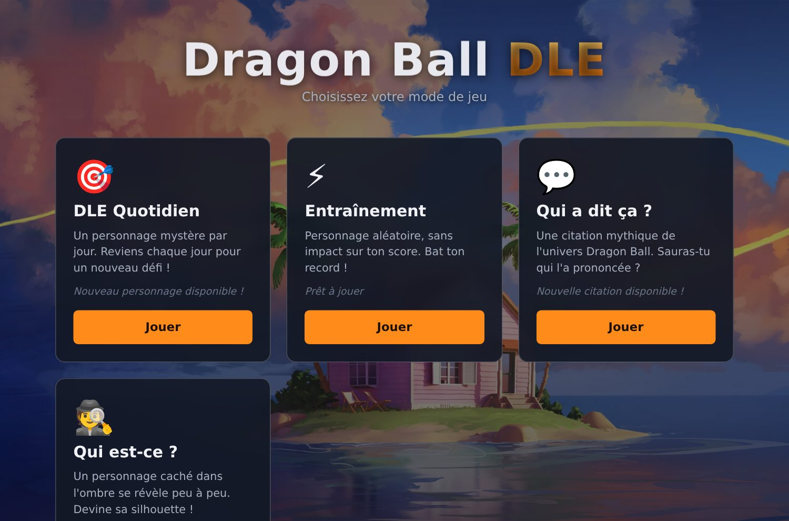

# Dragon Ball DLE

Un jeu de devinettes **quotidien** sur l'univers **Dragon Ball**, inspiré de Wordle et de LoLdle. Retrouve le personnage mystère du jour à partir de ses attributs, d'une citation culte ou de sa silhouette !



## 🎮 Modes de jeu

| Mode | Description |
|------|-------------|
| 🎯 **DLE Quotidien** | Devine le personnage mystère du jour. Chaque tentative révèle des indices (sexe, cheveux, origine, race, affiliation, épisode de 1ʳᵉ apparition, saga, série) avec un code couleur façon Wordle (vert = exact, jaune = partiel, rouge = différent, flèches = plus tôt/plus tard). |
| ⚡ **Entraînement** | Personnage aléatoire, sans impact sur le score, avec chronomètre. Bats ton record ! |
| 💬 **Qui a dit ça ?** | Une citation mythique t'est présentée : retrouve qui l'a prononcée. Un indice se dévoile à chaque erreur (série, race, affiliation, genre, initiale). |
| 🕵️ **Qui est-ce ?** | Une silhouette dans l'ombre se révèle progressivement à chaque mauvaise réponse. Reconnais le personnage le plus tôt possible ! |

Les défis « du jour » changent chaque jour à **minuit (heure de Paris)** et ta progression est sauvegardée localement (`localStorage`).

## 🚀 Lancer le projet

C'est un site **statique**, sans build ni dépendance. Deux options :

```bash
# Option 1 — ouvrir directement le fichier
#   (double-clic sur index.html, ou)
open index.html          # macOS  ·  xdg-open index.html sous Linux

# Option 2 — servir en local (recommandé pour le localStorage)
npx serve .              # puis ouvrir l'URL affichée
# ou
python3 -m http.server   # puis http://localhost:8000
```

## 🧩 Structure du projet

| Fichier | Rôle |
|---------|------|
| `index.html` | Hub : sélection du mode de jeu |
| `daily.html` · `practice.html` · `game.js` | Modes Quotidien & Entraînement (différenciés par `window.INITIAL_MODE`) |
| `quotes.html` · `quotes-game.js` · `quotes-data.js` | Mode « Qui a dit ça ? » |
| `silhouette.html` · `silhouette-game.js` | Mode « Qui est-ce ? » |
| `data.js` | Base de données des personnages |
| `style.css` | Styles (partagés entre toutes les pages) |
| `images/` | Portraits des personnages |

## 📋 Données

Chaque personnage de `data.js` possède les champs suivants :

| Champ | Exemple |
|-------|---------|
| `name` | `"Goku"` |
| `sex` | `"Masculin"` · `"Féminin"` · `"Neutre"` |
| `hair` | `"Noir"` |
| `origin` | `"Vegeta"` (planète/lieu d'origine) |
| `race` | `"Saiyan"` |
| `episode` | `1` (n° de 1ʳᵉ apparition, tous animes confondus) |
| `saga` | `"Saga Pilaf"` (ordre chronologique défini par `SAGA_ORDER`) |
| `serie` | `"DB / DBZ / DBGT / DBS"` |
| `affiliation` | `"Z-Fighters"` |
| `image` | `"images/goku.jpg"` |

## 🛠️ Stack

HTML / CSS / JavaScript **vanilla**. Aucune dépendance, aucune étape de build. Persistance via `localStorage`.

## ⚖️ Crédits

Projet **fan-made**, à but non lucratif et éducatif.
Dragon Ball © Akira Toriyama / Shueisha / Toei Animation.
